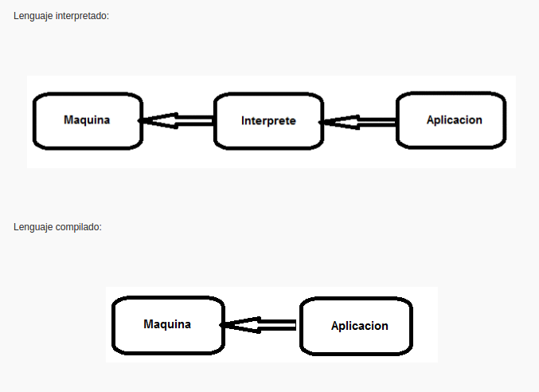

**Investigacion**


** Que es Java**

```
Java es un lenguaje de programación compilado
```

** Que es JavaScript**

```
javaScript es un lenguaje interpretado que se utiliza principalmente para crear páginas web
```



**Diferencias de Java & JavaScript**

| Diferencias | Descripcion     |
| :------------- | :------------- |
| JavaScript es un lenguaje interpretado, y Java es compilado.      | JavaScript son archivos de texto que pueden leer tanto los ordenadores como las personas, mientras que los de Java se compilan a un archivo especial optimizado para que lo lea un ordenador y lo ejecute.        |
| Java se depura en dos fases y JavaScript en una.      | En JavaScript solamente sabes si has cometido inadvertidamente un error de sintaxis cuando vas a ejecutar el programa. En Java sin embargo, primero se realiza la fase de compilación, en la que el compilador ya indica los posibles errores de sintaxis que existan.        |


**Que es un lenguaje Compilado y lenguaje interpretado**

```
Un lenguaje compilado es término un tanto impreciso para referirse a un lenguaje de programación que
típicamente se implementa mediante un compilador. Esto implica que una vez escrito el programa, éste se traduce a partir de su código fuente por medio de un compilador en un archivo ejecutable para una determinada plataforma (por ejemplo Solaris para Sparc, Windows NT para Intel, etc.).

Un lenguaje interpretado es un lenguaje que requiere un intérprete para implementar o ejecutar
 el código
```

**Semantica en HTML**
```
Las etiquetas semánticas ayudan a definir la estructura del documento y permiten que las páginas web sean mejor indexadas por los buscadores.
```


**Que es HTML & CSS**

```
Un documento HTML viene siendo coloquialmente “una página web”. Entonces podemos decir que el lenguaje
 CSS sirve para organizar la presentación y aspecto de una página web.
```
**Que es Sintaxis**
```
La sintaxis de un lenguaje de programación se define como el conjunto de reglas que deben seguirse
 al escribir el código fuente de los programas para considerarse como correctos para ese lenguaje de programación.
```
**Tipos de datos Boolean**
```
Un tipo de datos es la propiedad de un valor que determina su dominio (qué valores puede tomar), qué operaciones se le pueden aplicar y cómo es representado internamente por el computador.

Todos los valores que aparecen en un programa tienen un tipo.

1. Int: El tipo int (del inglés integer, que significa «entero») permite representar números enteros.
2.Float: El tipo float permite representar números reales
3. Complex: El tipo complex permite representar números complejos.
4. Boolean: Los valores lógicos True y False (verdadero y falso) son de tipo bool, que representa
valores lógicos.
5. String: A los valores que representan texto se les llama strings, y tienen el tipo str.
6. None: Existe un valor llamado None (en inglés, «ninguno») que es utilizado para representar
casos en que ningún valor es válido, o para indicar que una variable todavía no tiene un valor que tenga sentido.

```
**Tamanos de pantallas**
```
La industria informática, que se apoya en sistemas digitales, utiliza el término de resolución
vertical para definir el número de líneas activas y el término de resolución horizontal para el número de elementos básicos (píxeles por línea). En la tabla siguiente se muestran las características básicas de diferentes tarjetas gráficas.
```


**Porque se coloca el Script abajo en HTML**
```
Es por la ejecucion que se inicia en el html, el colocarlo abajo al momento que el navegador lo lee
primero te ejecuta el html, y luego los script.
```
